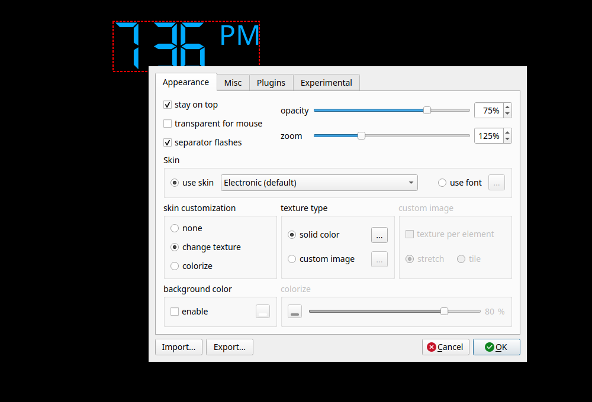

**English** · [中文](README.zh-CN.md)

# Digital Clock 4 — Linux Fork

> ⚠️ **This is a modified version of Digital Clock 4, not the original program.**
> Original: **Digital Clock 4, Copyright (C) 2013-2020 Nick Korotysh** ·
> forked from [Kolcha/DigitalClock4](https://github.com/Kolcha/DigitalClock4) ·
> modified by **ENum** (GitHub: [Enumber](https://github.com/Enumber)) ·
> licensed under **GPL-3.0-or-later** (unchanged) ·
> see [MODIFICATIONS.md](MODIFICATIONS.md) for exactly what was changed and when.

---

**An open-source desktop clock for Linux — 21 skins, 15 plugins, one-command
install. Qt 5, works fully on X11 (see the Wayland note below). Maintained.**

Upstream supported Linux but never packaged it: the last Linux release (4.7.9,
December 2020) is a bare tarball with no installer and no desktop integration.
**Upstream was archived in 2026 and is no longer developed — Linux fixes now
happen in this repository.** This fork builds cleanly from a fresh checkout,
installs with one command, ships the same skins and plugins the Windows build
does, fixes a number of long-standing bugs, and never phones home.

```sh
git clone https://github.com/Enumber/DigitalClock4.git && cd DigitalClock4 && bash install.sh
```



## Features

Everything the official Windows build has, on Linux:

* **21 skins** — the 19 that ship with the official Windows package, plus the
  two built-in ones. Or use any system font instead of a skin.
* **210 textures**, any color, adjustable opacity and zoom
* stays on top / click-through / drag to position
* **resilient multi-monitor placement** — new setups prefer a non-primary display;
  positions are saved per physical monitor, a disconnected clock moves to an available
  screen, and it returns to its original screen and position after reconnect or reboot.
  Non-primary screens may overlap their panel area (the position setting labels this
  explicitly as **Allows overlap with panel**).
* **15 plugins**: alarm, chime, countdown timer, date, IP address, quick note,
  random position, scheduler, spectrum clock, stopwatch, talking clock, tray
  colour, variable translucency, power off, any zoom
* UI follows the system language — English and 简体中文 both complete
  (upstream also has Русский and Português across all components, and
  Nederlands for the main window only); anything else falls back to English
* built-in "start at login" toggle in Settings, and the installer can set it
  up for you too — no manual autostart setup either way
* no update checker and no update notifications; the program does not contact
  the network on its own — 4.7.9 is the final 4.x release and there is
  nothing left to check for

Note on Wayland: the clock positions itself by calling `move()`, which Wayland
does not permit, so it cannot be dragged or restore its position there. On X11
everything works normally. See
[docs/why-linux-still-works.md](docs/why-linux-still-works.md) for the details
and the workaround.

## Install

```sh
git clone https://github.com/Enumber/DigitalClock4.git
cd DigitalClock4
bash install.sh
```

With a display it opens a **graphical installer** (TTY interview if none) that asks
where to install (your home directory, any custom path — admin-owned
locations like `/opt` just prompt for your password via `sudo` — or
system-wide), whether to start automatically at login, and whether you want a
desktop icon. The desktop icon is marked trusted, so double-clicking it
launches the clock directly, with no "allow launching" confirmation.

Non-interactive use: `bash install.sh --system`, `--prefix DIR`, `--autostart`,
`--no-desktop-icon`, `--uninstall` (GUI confirmation when a display is available), `--help`.

Build dependencies (Debian/Ubuntu; the installer builds from source
automatically when no prebuilt binary is present):

```sh
sudo apt-get install -y build-essential qtbase5-dev qtbase5-dev-tools \
  qttools5-dev-tools libqt5svg5-dev libqt5x11extras5-dev qtmultimedia5-dev \
  libqt5texttospeech5-dev libxi-dev
```

## Updating

There is no in-app updater by design (see Features above) — 4.7.9 is the
final 4.x release, so a version check has nothing to look for. To pick up
fixes from this fork, `git pull` and run `bash install.sh` again; it detects
the running clock, stops it, replaces the files, and starts it back up.

## Help wanted

This fork exists because the official Linux build was abandoned mid-tarball.
It has had real use and real bug fixes, but it is one person's spare-time
maintenance, not a team effort. Bug reports, testing on window managers other
than the ones this was verified on, and PRs are all very welcome. 🙂

---

## License

GPL-3.0-or-later, same as upstream — see [LICENSE.txt](LICENSE.txt).
Original work © 2013-2020 Nick Korotysh. Vendored third-party libraries:
[QHotkey](3rdparty/QHotkey/LICENSE) (BSD-3-Clause),
[SingleApplication](3rdparty/SingleApplication/LICENSE) (MIT).
The bundled `skins/` and `textures/` are **not** covered by that statement:
they are third-party artwork redistributed from the official Windows package
and we make no licence claim about them — see [skins/README.md](skins/README.md).
The original upstream README is preserved at
[docs/README.upstream.md](docs/README.upstream.md).
