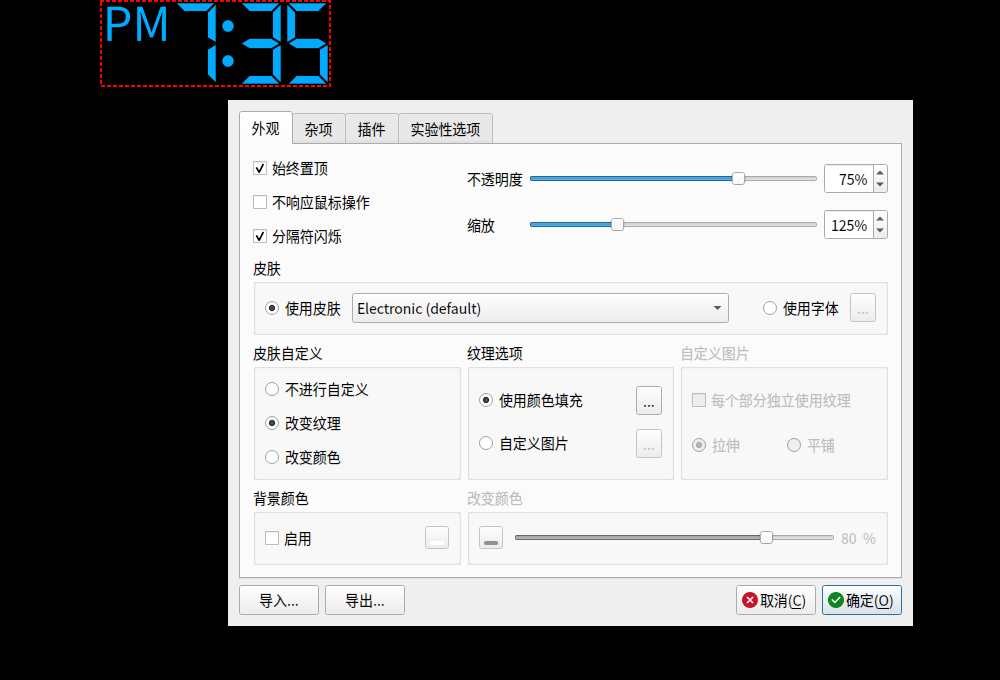

[English](README.md) · **中文**

# 数字时钟 Digital Clock 4 —— Linux 版

> ⚠️ **本项目是 Digital Clock 4 的修改版，不是原版程序。**
> 原版：**Digital Clock 4, Copyright (C) 2013-2020 Nick Korotysh** ·
> fork 自 [Kolcha/DigitalClock4](https://github.com/Kolcha/DigitalClock4) ·
> 修改者 **ENum**（GitHub：[Enumber](https://github.com/Enumber)）·
> 许可证仍为 **GPL-3.0-or-later**（未更改）·
> 具体改了什么、什么时候改的见 [MODIFICATIONS.md](MODIFICATIONS.md)。

---

**一款开源的 Linux 桌面时钟——21 套皮肤、15 个插件、一条命令安装。基于 Qt 5，
X11 下功能完整（Wayland 的限制见下文）。持续维护中。**

上游是支持 Linux 的，只是从未打包：最后一个 Linux 版（4.7.9，2020 年 12 月）
只是个裸 tarball，没有安装器、不进应用列表。**上游已于 2026 年归档、不再开发，
Linux 侧的修复现在都发生在本仓库。** 本 fork 全新检出即可编译、一条命令安装、
自带与 Windows 版相同的皮肤和插件，修掉了若干长期存在的 bug，并且不会主动联网。

```sh
git clone https://github.com/Enumber/DigitalClock4.git && cd DigitalClock4 && bash install.sh
```



## 功能

官方 Windows 版有的，Linux 上全都有：

* **21 套皮肤** —— 官方 Windows 包自带的 19 套，加上内置的 2 套。也可以不用
  皮肤，直接选系统里任意字体显示。
* **210 张纹理**，任意颜色、透明度、缩放随意调
* 置顶显示 / 鼠标穿透 / 拖动摆放位置
* **可靠的多屏位置恢复** —— 新安装在有多块屏幕时默认优先非主屏；每块物理显示器
  分别保存位置，屏幕断线时自动迁移到可用屏幕，重连或重启后回到原屏原位置。非主屏
  可以覆盖面板区域，位置设置旁会明确显示**「可覆盖面板」**。
* **15 个插件**：闹钟、整点报时、倒计时、日期、IP 地址、便捷笔记、随机位置、
  日程表、频谱时钟、秒表、语音报时、托盘图标颜色、透明度渐变、定时关机、任意缩放
* 界面跟随系统语言：简体中文与英文都是完整的（上游另有覆盖全部组件的俄语、葡萄牙语，
  以及只覆盖主窗口的荷兰语），其他语言默认英文
* 设置里自带「开机启动」开关，安装器也能帮你顺手设好，两种方式都不用手动配置
* 没有更新检查、没有更新提示；程序不会主动联网——4.7.9 已是 4.x 最后一版，
  也确实没什么可查的了

关于 Wayland：时钟靠调用 `move()` 给自己定位，而 Wayland 不允许客户端这么做，
所以在 Wayland 下拖不动、也记不住位置。**X11 下一切正常。**
详细说明和绕开办法见 [docs/why-linux-still-works.zh-CN.md](docs/why-linux-still-works.zh-CN.md)。

## 安装

```sh
git clone https://github.com/Enumber/DigitalClock4.git
cd DigitalClock4
bash install.sh
```

安装器按系统语言说中文或英文，会依次询问：装到哪（用户目录、任意自定义路径
——像 `/opt` 这类管理员目录输入密码即可（由 `sudo` 提示）、或系统级安装）、
要不要开机自启动、要不要桌面图标。桌面图标已标记为可信，双击直接启动，
不会弹「是否允许启动」确认框。

非交互用法：`bash install.sh --system`、`--prefix 目录`、`--autostart`、
`--no-desktop-icon`、`--uninstall`、`--help`。

编译依赖（Debian/Ubuntu；没有现成二进制时安装器会自动从源码编译）：

```sh
sudo apt-get install -y build-essential qtbase5-dev qtbase5-dev-tools \
  qttools5-dev-tools libqt5svg5-dev libqt5x11extras5-dev qtmultimedia5-dev \
  libqt5texttospeech5-dev libxi-dev
```

## 更新

按设计**没有**程序内更新检查（见上面「功能」一节）——4.7.9 已是 4.x 最后一版，
版本检查也没什么可查的了。想拿到本 fork 的新修复，`git pull` 后再跑一次
`bash install.sh` 就行；它会自动检测到正在运行的时钟、退出旧版本、替换文件、
再重新拉起来。

## 帮忙一起维护

这个 fork 的起因，是官方版本的 Linux 支持烂尾在一个裸压缩包里。它已经过真实
使用和真实修 bug 的考验，但终究是个人业余时间在维护，不是团队项目。欢迎提
bug、欢迎在本项目没测过的其他窗口管理器上帮忙试用、也欢迎 PR。🙂

---

## 许可证

与上游一致，GPL-3.0-or-later，见 [LICENSE.txt](LICENSE.txt)。
原作品 © 2013-2020 Nick Korotysh。内置第三方库：
[QHotkey](3rdparty/QHotkey/LICENSE)（BSD-3-Clause）、
[SingleApplication](3rdparty/SingleApplication/LICENSE)（MIT）。
随包的 `skins/` 与 `textures/` **不在上述声明范围内**：它们是从官方 Windows 包
搬运的第三方素材，我们不对其授权做任何主张，详见 [skins/README.md](skins/README.md)。
上游原版 README 存档于 [docs/README.upstream.md](docs/README.upstream.md)。
